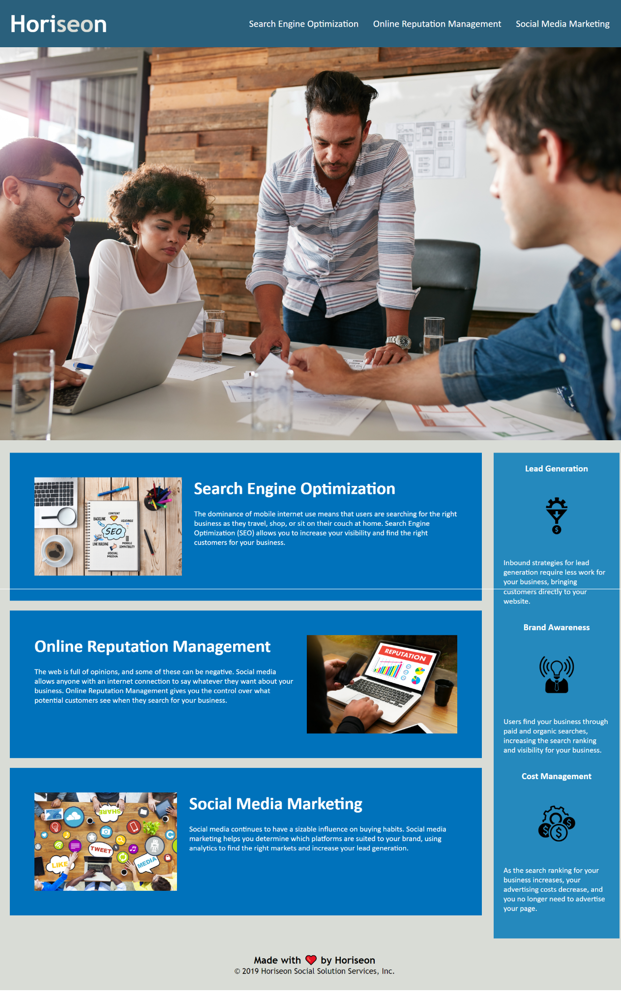

# Horiseon Social Solution Services, Inc. README.md

## Changes Made to Starter Code

    Starter code plus a few changes to the Header

        -Changed the parent div tag to a header tag

        -Changed the next div tag to a nav tag

            --Updated the CSS code on lines 11 through 42 to reflect these changes

        -Fixed the link in the first a tag so that an input of a Click would take viewer to desired location of the Search Engine Optimization section

 **Updated content section**

    Updates to the Title and body paragraphs of the web page

        -changed the title to reflect the web page shown instead of saying website

        -changed div tags to more semantic tags such as section

        -Added alt values to images in the content section making it more accessible 

        -Organized code in Header and Content sections with footnotes to make it more readable

**Cleaned up sidebar and css file**

    Organization of the sidebar and css file
        
        -Organized the work with footnotes to make more readable

        -Set the alt values to blank to make the site more accesible

        -Changed the img tage on cost management to be a self-closing tag

        -Made code more semantic by replace div tags

        -Condensed unnecessary  css code by putting all of the benefits sidebar under one HTML class

        -Organized the css properties to follow the structure of the HTML

## Screenshot of Finished Site

## Links to Repository and Webpage

https://github.com/JonathanSaunders98/horiseon-social-solutions

https://jonathansaunders98.github.io/horiseon-social-solutions/

